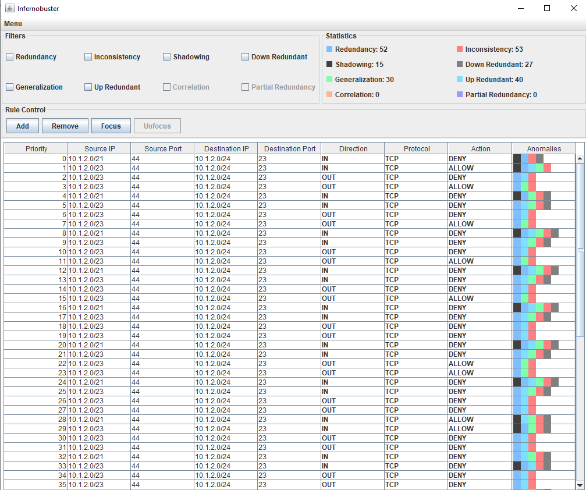

# Infernobuster

# About
Infernobuster is a tool that can analyze and isolate conflicting firewall rules in a firewall rule configuration file. The tool can be used to help modify existing rules and create non-conflicting rules. Currently, the supported firewall types are UFW and IPtables. The tool does not modify the original configuration file. Instead, the user may export a new configuration file which they can choose to deploy.

Infernobuster is built with Java only. A screenshot of Infernobuster is shown below:

## Supervisor
Dr. Jason Jaskolka

## Authors
- Hoang Bui
- Michael Fan
- Tamer Ibrahim
- Mrunal Patel
- Souheil Yazji

# About our Project
A Youtube video about our project can be found [here](https://www.youtube.com/watch?v=WFze8DN9dI4).

# Tutorial video
A Youtube video about how to use infernobuster can be found [here](https://youtu.be/flbTEQttjD4).

# Dependencies

1. JUnit 4 - This is used for unit testing. 
`        <dependency>
            <groupId>junit</groupId>
            <artifactId>junit</artifactId>
            <version>4.12</version>
            <scope>test</scope>
        </dependency>
`
2. Apache Common Net - This is used for evaluating subnet masks.
`       <dependency>
            <groupId>commons-net</groupId>
            <artifactId>commons-net</artifactId>
            <version>3.6</version>
        </dependency>
`

## Building and Running
First clone the project like  
`git clone https://github.com/mpfan/InfernoBuster.git` 

Then navigate to the project folder like  
`cd ./InfernoBuster`  

From here you can either use Intellij or the command line to run the project.
### Intellij
To use Intellij simply open the project using Intellij.

### Command line
To use the command line first navigate to the source code directory like  
`cd ./infernobuster`  

The project is a maven project so use the maven commands to build the project. For exmaple, 
To build the project run  
`mvn package`  

Then to run the project do  
`java -jar ./target/infernobuster-1.0-SNAPSHOT`  
or click on the jar file. 

## Testing
All tests can be found in `infernobuster/src/test/java`. To run the tests do  
`mvn test`

## Contributions
Use the following link for [Commit Convention](https://www.conventionalcommits.org/en/v1.0.0/). All contributions to the project should pretain to an [Issue](https://github.com/mpfan/InfernoBuster/issues). Individual contributions to the project should be made through Pull Requests into the dev branch.
